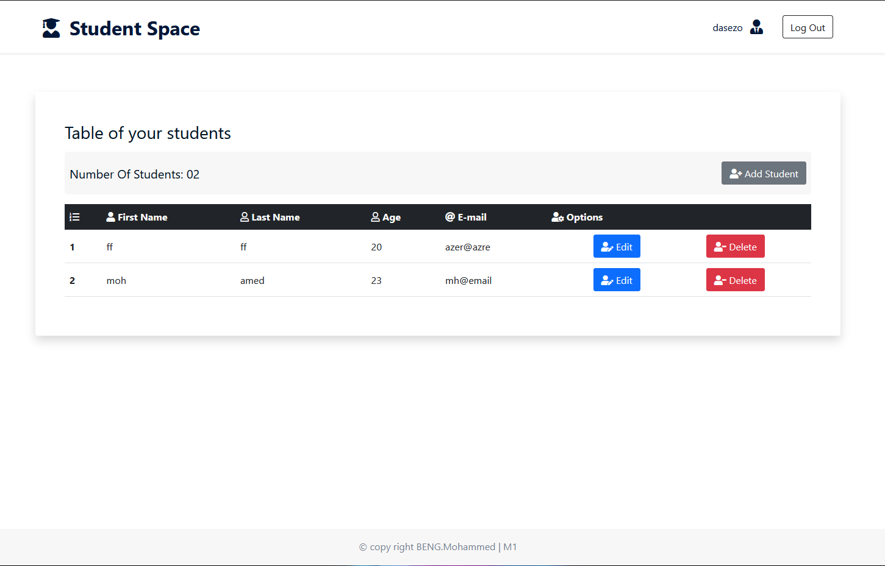

# Student Space | PHP - CRUD Application (OOP)

## Description

This project is a university assignment aimed at practicing PHP with CRUD operations. It provides a PHP-based CRUD (Create, Read, Update, Delete) application using OOP (Object Oriented Programming) for managing student information list. The application allows users to perform Create, Read, Update, and Delete students.

## Installation

This small project is very simple, You need to have PHP and MySQL in your machine.
1- Clone the repo.
2- Create the Database on your MySQL server using the provided "schema.sql" file.
3- Change the DB credentials inside the "app/core/Database.php" according to your settings.
4- Sign up and Start using the app.
